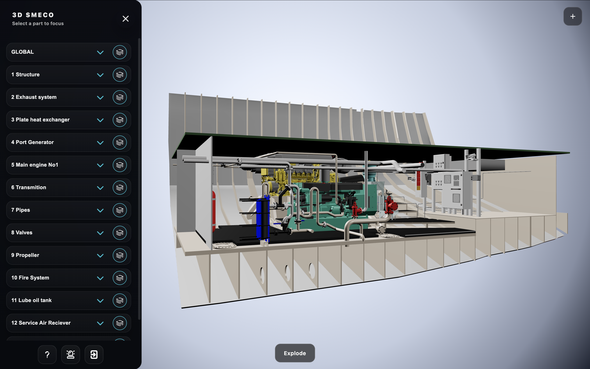
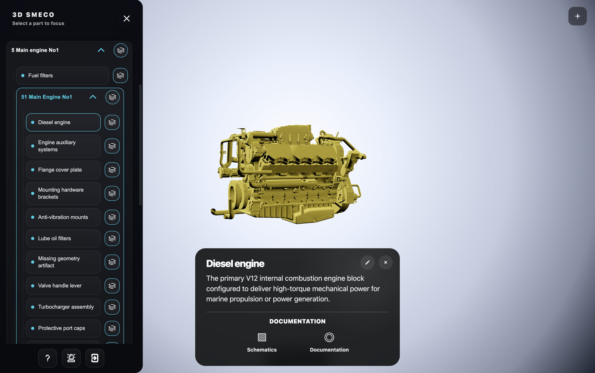
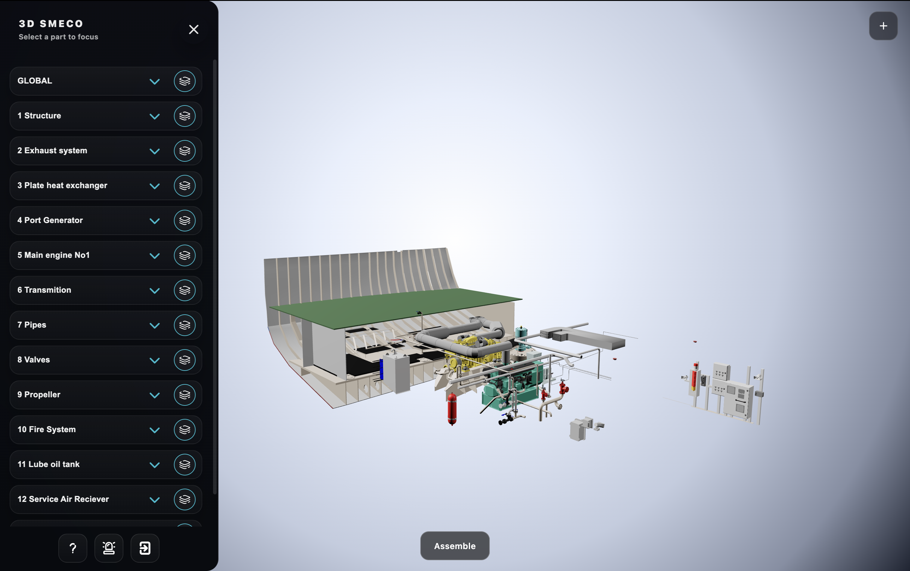

<div align="center">


# SMECO 2.0 - Ship engine viewer

A production-grade interactive 3D digital twin platform for marine propulsion systems.

[](https://threejs.org)
[](https://vitejs.dev)
[](https://nodejs.org)
[](https://expressjs.com)
[](LICENSE)

[Live Demo](#) · [Report Bug](https://github.com/alphawave-software/engine/issues) · [Request Feature](https://github.com/alphawave-software/engine/issues)

</div>

---



---

## Overview

SMECO 2.0 is a browser-based 3D digital twin viewer built for the inspection and documentation of complex ship engine room assemblies. The platform renders a full-scale marine propulsion system in real-time WebGL, allowing engineers and technical staff to navigate component hierarchies, isolate individual parts, trigger animated exploded views per ship system, and access linked PDF documentation — all within a single-page web application requiring no plugins or native installation.

The project was designed from the ground up with a modular architecture that cleanly separates the 3D rendering core, model-specific logic, controller behaviours, and UI — making it straightforward to extend with new vessel models, additional documentation modules, or different engineering domains entirely.

---

## Table of Contents

- [Features](#features)
- [Architecture](#architecture)
- [Tech Stack](#tech-stack)
- [Project Structure](#project-structure)
- [Getting Started](#getting-started)
- [API Reference](#api-reference)
- [Ship Systems](#ship-systems)
- [Design Decisions](#design-decisions)
- [Roadmap](#roadmap)

---

## Features

### Real-Time 3D Rendering
- WebGL-accelerated rendering via Three.js with ACESFilmic tone mapping and PCF soft shadows
- DRACO-compressed GLB asset loading (~14 MB model delivered efficiently via local WASM decoder)
- Adaptive pixel ratio capping at 2× for performance/quality balance across devices
- Transparent canvas with full light/dark theme switching — scene background and light intensities update live

### Interactive Component Inspection

The platform allows engineers to isolate individual components, inspect technical metadata, and access linked documentation directly from the 3D environment.



- **Raycaster picking** — click any mesh in the 3D scene to select and inspect it
- **Focus / isolation mode** — selected component is highlighted while the rest of the model fades; camera animates to fit the part in frame
- **Hover highlighting** — emissive color overlay on mouseover for instant part identification
- **3D floating labels** — CSS2DObject labels anchored to component positions in world space
- **Smooth camera snap** — one-click camera rotation to orthographic-aligned views (front, back, left, right, top, bottom) with animated transition

### Exploded Views

The platform supports both full-model and subsystem-level exploded views, enabling engineers to better understand spatial relationships, assembly structure and component positioning.



- **Global explode** — separates all 13 ship systems simultaneously using a hand-authored CAD-style displacement config with per-part offset vectors and rotations; animated with a custom smoothstep RAF loop (2.2 s duration)

- **Per-system explode** — isolates and explodes a single selected system, with each subgroup configured for a specific direction and travel distance; uses GSAP when available with a RAF fallback

### Hierarchical Navigation
- Sidebar driven by a logical tree rebuilt from the raw GLB Object3D graph
- 13 top-level ship systems, each expandable to full assembly → subassembly → component depth
- Visibility toggles per node, propagating down the subtree
- Full reset: camera, visibility, explode state, focus mode — restored in a single action

### Component Documentation System
- Every component links to its metadata stored in the backend: title, description, and three PDF document slots (documentation, schematics, maintenance)
- Inline edit mode — engineers can update titles and descriptions directly in the viewer
- PDF upload via multipart form — files stored server-side and linked to the component key
- Fuzzy key resolution — normalised Unicode matching handles Croatian/English diacritics, underscore/hyphen/dot separators, and case differences

### Authentication
- JWT-based login screen gating the entire viewer
- Token persisted in `localStorage`; silently validated on page load — valid sessions skip the login screen entirely

### Emergency System Simulation
- Emissive warning light simulation on specific mesh groups, representing active alarm states in the engine room

---

## Architecture

The application follows a strict layered architecture with no framework — intentionally, to demonstrate direct command of the underlying browser APIs and Three.js internals.

```
┌─────────────────────────────────────────────────────┐
│                    index.html (SPA)                  │
│         Single HTML shell — all UI inline            │
└────────────────────┬────────────────────────────────┘
                     │ ES module entry
                     ▼
┌─────────────────────────────────────────────────────┐
│               app.entry.js                          │
│  Orchestrator: auth flow, model loading,            │
│  theme, camera controls, explode state machine      │
└──────┬───────────────────────┬──────────────────────┘
       │                       │
       ▼                       ▼
┌─────────────┐     ┌──────────────────────────────────┐
│  auth.js    │     │         viewer.core.js            │
│  JWT login  │     │  Three.js runtime factory         │
│  VPS API    │     │  Scene · Renderer · Camera        │
└─────────────┘     │  OrbitControls · Lighting         │
                    │  GLTFLoader · DRACOLoader          │
                    └──────────────┬───────────────────┘
                                   │ loadModelModule(mod)
                                   ▼
                    ┌──────────────────────────────────┐
                    │       engine.model.js            │
                    │  Model Module (pluggable)        │
                    │  Loads GLB · Wires controllers   │
                    └──┬───────────────────────────────┘
                       │
          ┌────────────┼─────────────────────────────┐
          ▼            ▼                              ▼
   ┌────────────┐ ┌──────────────────────┐  ┌────────────────┐
   │  tree.js   │ │    controllers/      │  │  ui/sidebar/   │
   │  Rebuilds  │ │  picking · focus     │  │  Render tree   │
   │  logical   │ │  hover · labels      │  │  Edit/save     │
   │  hierarchy │ │  explode · visibility│  │  components    │
   │  from GLB  │ │  reset · systemExp.  │  │  Components    │
   └────────────┘ └──────────────────────┘  │  REST API      │
                                            └───────┬────────┘
                                                    │
                                                    ▼
                                        ┌───────────────────┐
                                        │   backend/        │
                                        │   Express API     │
                                        │   components.json │
                                        │   PDF storage     │
                                        └───────────────────┘
```

### Model Module Pattern

Any new vessel model can be integrated by creating a module that satisfies this contract and registering it in `MODEL_REGISTRY`:

```js
export const id = 'engine';
export const name = '3D Engine';
export const url = '/glb/FIXED_ENGINE_ROOM.glb';
export const viewPreset = { dir, distanceMul, offset, targetOffset };

export async function load(ctx)  { /* receives viewer API, sets up scene */ }
export async function dispose()  { /* cleanup all listeners and references */ }
export function toggleExplode()  { /* returns Boolean or Promise<Boolean> */ }
export function toggleSystemExplode() { ... }
```

The architecture currently ships with one model (`engine`). Adding a second requires only the new module file and a one-line registry entry.

---

## Tech Stack

| Layer | Technology | Version | Notes |
|---|---|---|---|
| **3D Rendering** | Three.js | 0.160.0 | Scene, renderer, camera, controls, loaders |
| **Build Tool** | Vite | ^7.3.1 | Dev server, HMR, path aliases, bundle analyser |
| **Language** | Vanilla JS | ES2022 | Pure ES modules, no framework |
| **Animation** | GSAP | CDN (optional) | Camera transitions, explode sequences. Graceful fallback if absent |
| **Compression** | DRACOLoader | Three.js addon | Local WASM decoder — no CDN dependency |
| **Backend** | Node.js + Express | 18+ / ^5.2.1 | REST API, ESM (`"type": "module"`) |
| **File Upload** | multer | ^2.1.1 | PDF documents, max 25 MB |
| **Data Storage** | JSON flat file | — | `backend/data/components.json` — zero-config, human-readable |
| **Auth** | JWT | — | Bearer token, localStorage persistence |

---

## Project Structure

```
Ship_engine/
├── index.html                  # SPA shell — all UI elements inline
├── vite.config.js              # Build config + path aliases (@app, @engine, @ui, @shared)
├── package.json                # Frontend dependencies
├── start.sh                    # One-command setup and launch script
├── .env                        # VITE_API_BASE_URL (auth backend, not committed)
│
├── config/
│   └── api.js                  # Components API base URL (dev/prod auto-switch)
│
├── viewer/
│   ├── auth.js                 # JWT auth: login, logout, validateToken, authFetch
│   ├── preloader.js            # Loading overlay controller
│   │
│   ├── app/
│   │   └── app.entry.js        # Application entry — orchestrates everything
│   │
│   ├── engine/
│   │   ├── core/
│   │   │   └── viewer.core.js  # Three.js runtime factory
│   │   └── models/
│   │       └── engine/
│   │           ├── engine.model.js          # Model root — load / dispose / explode API
│   │           ├── tree.js                  # GLB → logical tree with paths and groups
│   │           ├── names.js                 # Node name formatting utilities
│   │           ├── utils.js                 # isRenderablePart() and helpers
│   │           ├── controllers/
│   │           │   ├── picking.js           # Raycaster click detection
│   │           │   ├── focus.js             # Component isolation + info panel + API
│   │           │   ├── hover.js             # Emissive highlight on mouseover
│   │           │   ├── labels.js            # CSS2DObject floating labels
│   │           │   ├── visibility.js        # Show / hide mesh subtrees
│   │           │   ├── explode.js           # Global explode animation (smoothstep RAF)
│   │           │   ├── explode.config.js    # Per-system displacement vectors + rotations
│   │           │   ├── systemExplode.js     # Per-system explode (GSAP / RAF)
│   │           │   ├── system-explode.config.js  # Config for all 13 systems
│   │           │   └── reset.js             # Full scene reset
│   │           └── ui/
│   │               └── sidebar/
│   │                   └── engine.sidebar.js  # Bridges tree → sidebar UI
│   │
│   └── ui/
│       └── sidebar/            # Generic sidebar component (model-agnostic)
│           ├── render.js       # DOM rendering + API integration
│           ├── state.js        # Reactive sidebar state
│           ├── dom.js          # DOM references and helpers
│           ├── panels.js       # Accordion expand / collapse
│           ├── events.js       # All event listeners
│           ├── icons.js        # SVG icon factories
│           └── api.js          # Sidebar API helpers
│
├── css/
│   ├── viewer-base.css         # Reset, root variables, layout base
│   ├── viewer-ui.css           # All UI: sidebar, toolbar, info panel, login, menus
│   ├── viewer-preloader.css    # Preloader overlay animation
│   └── viewer-sidebar.css      # Sidebar-specific overrides
│
├── public/
│   ├── glb/
│   │   └── FIXED_ENGINE_ROOM.glb   # Primary 3D asset (14 MB, DRACO-compressed)
│   ├── docs/
│   │   ├── components/         # Dynamically uploaded component PDFs
│   │   ├── main_docs/          # Static ship system technical drawings
│   │   └── help/               # Platform user guide
│   └── draco/gltf/             # DRACOLoader WASM runtime (local)
│
└── backend/
    ├── server.js               # Express REST API
    ├── package.json
    └── data/
        └── components.json     # Component metadata store (auto-created)
```

---

## Getting Started

### Prerequisites

- Node.js 18 or newer
- npm

### Installation

Clone the repository:

```bash
git clone https://github.com/Armin-000/Ship_engine.git
cd Ship_engine
```

Create a `.env` file in the project root:

```bash
VITE_API_BASE_URL=http://your-auth-backend-url
```

Run the startup script — it handles everything automatically:

```bash
# macOS / Linux
chmod +x start.sh
./start.sh

# Windows (Git Bash or WSL)
./start.sh
```

The script will:
1. Verify your Node.js installation
2. Install frontend dependencies (`npm install`)
3. Install backend dependencies (`cd backend && npm install`)
4. Create required directories (`backend/data/`, `public/docs/components/`)
5. Start the backend API server on port `3001`
6. Start the Vite frontend server on port `5173`
7. Open the application in your default browser

### Manual Start (alternative)

```bash
# Terminal 1 — backend
cd backend
npm start

# Terminal 2 — frontend
npm run dev
```

### Build for Production

```bash
npm run build
```

Output is written to `dist/`. To analyse the bundle:

```bash
npm run build:analyze
```

### Development URLs

| Service | URL |
|---|---|
| Frontend | http://localhost:5173 |
| Backend API | http://localhost:3001 |
| Health check | http://localhost:3001/api/health |

---

## API Reference

The backend exposes a REST API for component metadata and PDF document management.

Base URL: `http://localhost:3001` (dev) · `https://ship-engine.onrender.com` (prod)

| Method | Endpoint | Description |
|---|---|---|
| `GET` | `/api/health` | Service health check |
| `GET` | `/api/components` | Retrieve all stored component metadata |
| `GET` | `/api/components/resolve` | Fuzzy-resolve a component by key + candidate names |
| `GET` | `/api/components/:key` | Retrieve one component by exact key |
| `PUT` | `/api/components/:key` | Create or update a component record |
| `POST` | `/api/upload/document` | Upload a PDF file (multipart, max 25 MB) |
| `DELETE` | `/api/components/:key` | Delete a component record |
| `GET` | `/docs/components/:filename` | Serve a stored PDF file |

### Component key format

Every 3D mesh is identified by its path through the scene graph, built at runtime by `tree.js`:

```
path:Scene/FULL/1_Structure/11_Floor/113_Engine_Room_Base/Object_5_3
```

### Component record schema

```json
{
  "path:Scene/FULL/1_Structure/11_Floor/113_Engine_Room_Base/Object_5_3": {
    "title": "Transverse foundation girder",
    "description": "Transverse bracing element providing lateral stiffness and structural integrity to the machinery bed.",
    "documents": {
      "documentation": "/docs/components/1780433957970-c32_1000_hp_specifications.pdf",
      "schematics": null,
      "maintenance": null
    },
    "updatedAt": "2026-06-03T09:02:34.043Z"
  }
}
```

---

## Ship Systems

The engine room model is organised into 13 independently navigable and explodable ship systems:

| # | System |
|---|---|
| 1 | Structure |
| 2 | Exhaust System |
| 3 | Plate Heat Exchanger |
| 4 | Port Generator |
| 5 | Main Engine No. 1 |
| 6 | Transmission |
| 7 | Pipes |
| 8 | Valves |
| 9 | Propeller |
| 10 | Fire System |
| 11 | Lube Oil Tank |
| 12 | Service Air Receiver |
| 13 | Duplex Oil Strainer |

Each system contains a hierarchy of assemblies, subassemblies, and individual named components. Every level of the hierarchy is separately navigable, isolatable, and documentable.

---

## Design Decisions

**No frontend framework.** The decision to use vanilla ES modules rather than React or Vue was deliberate. The application's primary complexity is 3D scene management, not component state trees — Three.js already provides the rendering abstraction, and introducing a virtual DOM layer would add overhead without solving a real problem here.

**GSAP as an optional peer dependency.** Rather than adding a hard npm dependency, GSAP is loaded via CDN and accessed as `window.gsap || null` throughout the codebase. Every animation code path has a functional RAF fallback, which means the application runs correctly — with slightly less polished easing curves — if the CDN load fails or is blocked.

**Two separate API origins.** Authentication (JWT login, token validation) runs against a dedicated VPS. Component metadata and PDF storage run against a separate service on Render. These concerns are intentionally decoupled: swapping or scaling the document storage service does not affect user authentication.

**JSON flat file as the database.** For this use case — a single-writer system where an engineer updates component metadata — a flat JSON file is operationally simpler than a database, trivially human-readable and editable, and trivially version-controllable. Migration to SQLite or PostgreSQL is a well-defined future step.

**Local DRACO decoder.** The DRACOLoader WASM runtime is bundled locally in `public/draco/gltf/` rather than pointing to the Google CDN. This eliminates a cross-origin dependency for an asset critical to the initial load path.

---

## Roadmap

- [ ] JWT middleware on the components API (currently open CRUD)
- [ ] Database migration — SQLite or PostgreSQL
- [ ] Additional vessel models — architecture is ready, requires only a new model module
- [ ] 3D annotation billboards anchored to specific mesh positions
- [ ] TypeScript migration — incremental, starting from `viewer.core.js`
- [ ] CI/CD pipeline with static build and automated deployment
- [ ] Mobile-optimised touch controls and responsive sidebar layout

---

## License

ISC — see [LICENSE](LICENSE.md) for details.

---

<div align="center">
Built with Three.js · Vite · Node.js · Express
</div>
